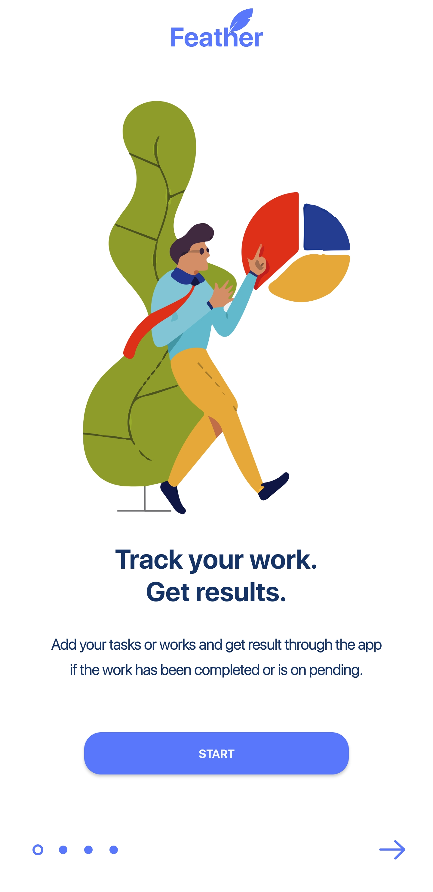
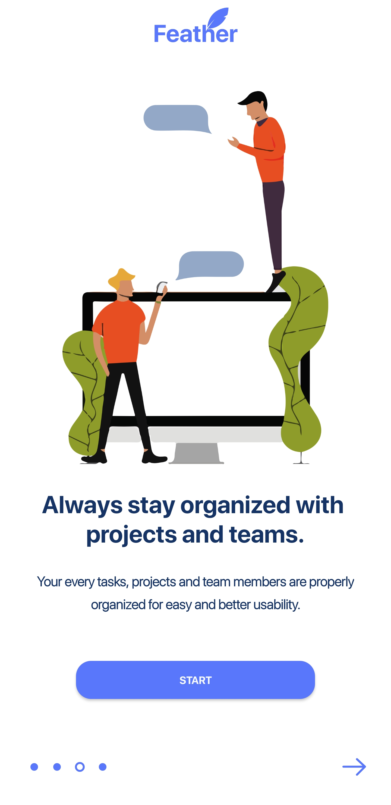
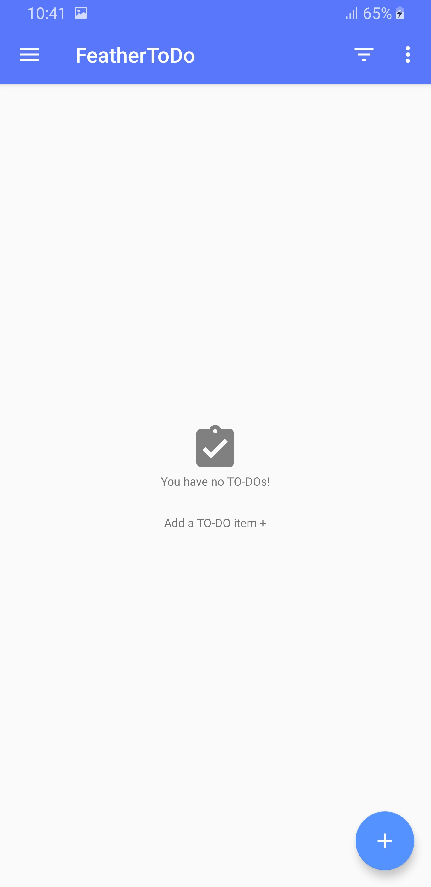
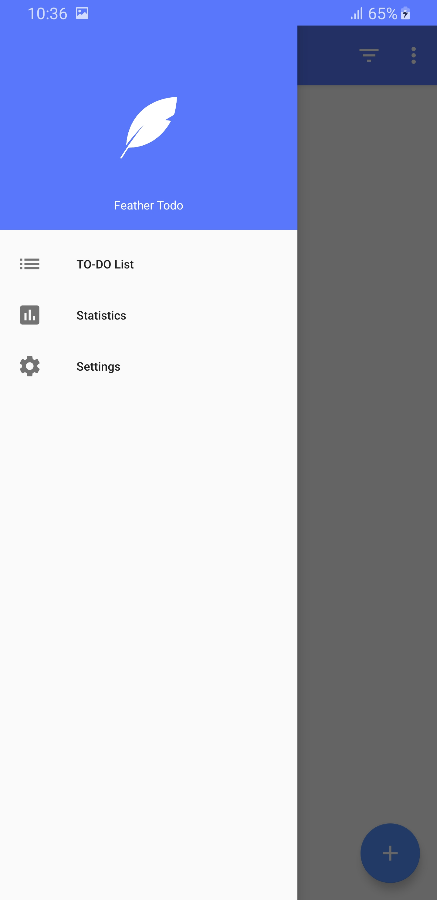
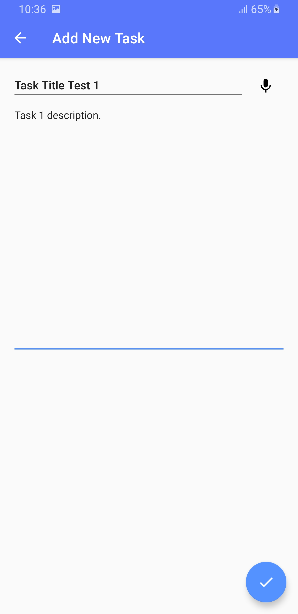
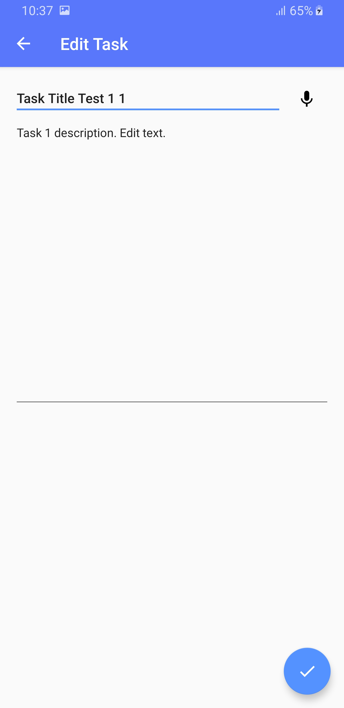
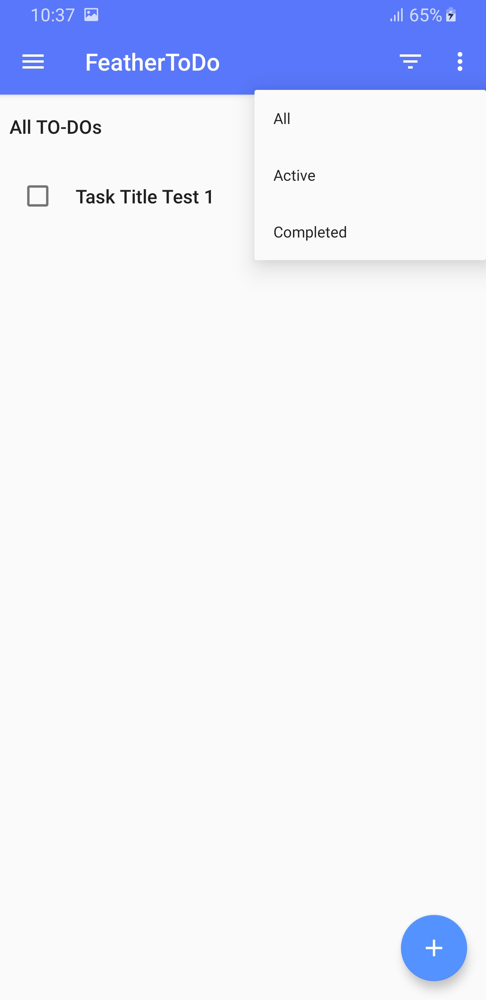
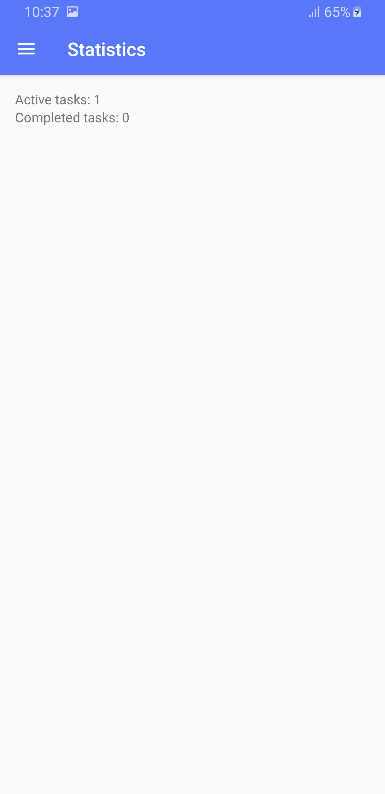

# FEATHER TODO

Feather Todo is an android appplication which allows users to list their todos. User c
an create new tasks with description. He/she can edit and delete the exisiting tasks.
Other features that this app incluides are clean minimal design, filtration of tasks, 
statistics, onBoarding screen, navigation drawer.

### Submitted by: Anuj Pandey
### Student ID : 77203054

# Features
1. Add task and description.
2. Clean and minimal design.
3. Filtration of tasks (Active, Completed and All).
4. Statistics.
5. Onboarding Screen.
6. Navigation drawer.

# Architecture
Model View View Model (MVVM)
> MVVM is an architectural pattern applied in applications to separate user interface 
code from data and business logic. With the clear separation of these components, all components 
of an app can be unit-tested, components can be reused within the app or across the app, and enhancements
 to the app can be made without refactoring all the components.

# Database
> SQLlite (Usage of Database Access Object)

# Illustrations Used

# Logos

# Screen Shots
  
  
  

# License
Copyright 2019 Anuj Pandey
The British College - Thapathali, Nepal.
